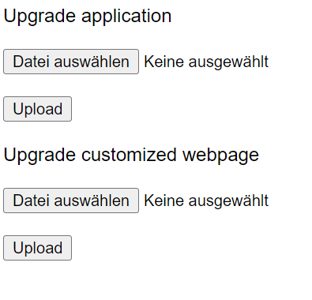
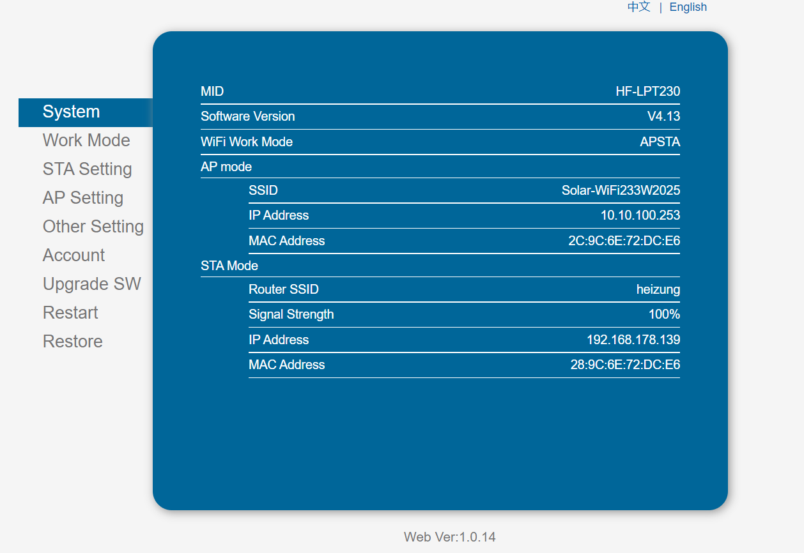

# How to set up WebUI to intercept Data

1. Open up your WebUI of your GoodWe Device
2. Add /iweb.html at the end of the IP
3. Upload the WebUI.bin to "Upgrade customized webpage" as seen below:

4. Click "Upload"

### After Rebooting the UI will look different - don't freak out :D

1. Go to "Other Setting"
2. Change the Server Address to the IP where the Python Script is running
3. Click "Save" and "Restart" after it

Enjoy ;)